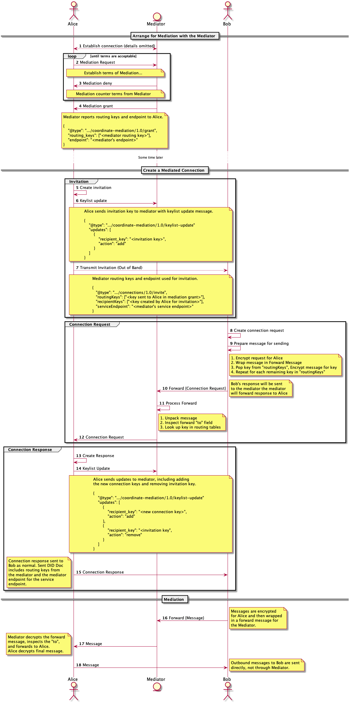

# Mediation flow

## Concepts and extensions
* **DIDComm Message Forwarding** - Sending an encrypted message to its recipient by first sending it to a third party 
  responsible for forwarding the message on. 
  Message contents are encrypted once for the recipient then wrapped in a [forward message](https://github.com/hyperledger/aries-rfcs/blob/master/concepts/0094-cross-domain-messaging/README.md#corerouting10forward) encrypted to the third party.
* **DIDComm queue transport** - Messages are held at the sender for [pickup](https://github.com/hyperledger/aries-rfcs/tree/main/features/0212-pickup) by the recipient.
  Recipient should explicitly declare this [route option](https://github.com/decentralized-identity/didcomm-messaging/blob/main/extensions/return_route/main.md#queue-transport)

## Using a Mediator
There are two variants to pull inbound messages from mediator:
  1. recipient establish P2P connection with mediator (see schemas below) via [rfc-0160](https://github.com/hyperledger/aries-rfcs/tree/main/features/0160-connection-protocol)
  [rfc-0023](https://github.com/hyperledger/aries-rfcs/tree/main/features/0023-did-exchange) protocol, then mediator declare 
  endpoint URL (typically ws:// or http:// url) to retrieve forwarded messages
  2. recipient establish P2P connection with mediator via [rfc-0160](https://github.com/hyperledger/aries-rfcs/tree/main/features/0160-connection-protocol)
  [rfc-0023](https://github.com/hyperledger/aries-rfcs/tree/main/features/0023-did-exchange) protocol, unlike 
  previous case, recipient set [```didcomm:transport/queue```](https://github.com/decentralized-identity/didcomm-messaging/blob/main/extensions/return_route/main.md#queue-transport) 
  as endpoint, in this case mediator will queue all incoming forwarded messages to make available to poll messages
  by recipient via [pickup](https://github.com/hyperledger/aries-rfcs/tree/main/features/0212-pickup) protocol.

## Mediator Message Flow Overview


See sample code of establish connection with mediator [here](/examples/case1_starting.py)
